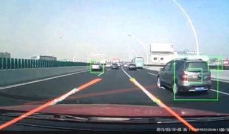

# car_pedestrian_line_detection
used to detect line and car with opencv3.2 and vs2015
This is used to detect cars; pedestrain and line. It can give back the center location of cars and pedestrain. It also can give back the
slope of lane line.
It used haar detector and Hough Transform to achieve the goal.

### 1. introduction 

If you want to use your own video, you should change the line 34 to you video address, and the just to make this file again is fine ~~~~

